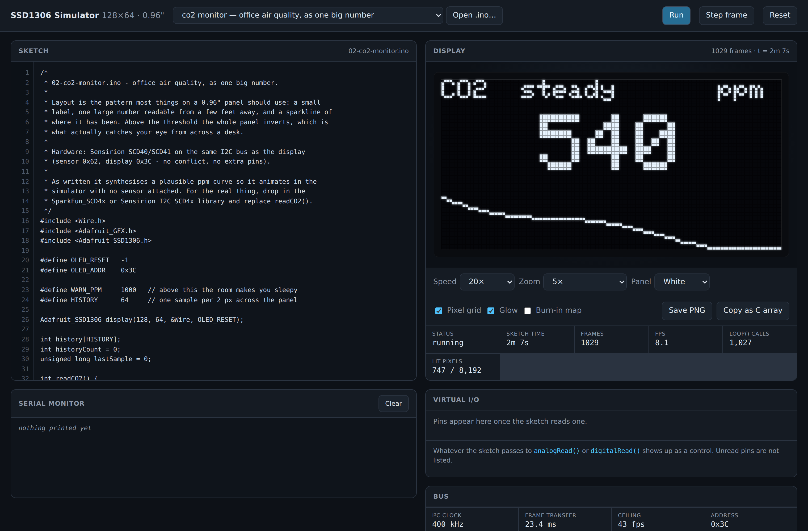

# SSD1306 128×64 Simulator

Runs an Arduino `.ino` sketch and shows you what this project's OLED would
display — in a browser, or from the command line. No hardware, no toolchain, no
dependencies.

It is not a mock. The drawing primitives are ports of the actual Adafruit_GFX
algorithms, the font is the byte-for-byte `glcdfont.c` table, and the
framebuffer has the same page-major layout as the controller's GDDRAM. What you
see here is what the panel puts on the glass.



---

## Quick start

**Browser** — open `simulator/index.html` directly. No server, no build step.

```
open simulator/index.html          # macOS
xdg-open simulator/index.html      # Linux
```

Pick an example from the dropdown, or drop your own `.ino` anywhere on the page.
Edits in the editor re-run automatically.

**Command line:**

```bash
# Print the screen as text
node simulator/cli/render.js simulator/examples/02-co2-monitor.ino --ascii

# A PNG at a specific moment
node simulator/cli/render.js my-sketch.ino --at 5000 --out frame.png --scale 6

# A sequence, 250 virtual ms apart
node simulator/cli/render.js my-sketch.ino --frames 12 --every 250 --out anim/

# Feed it a sensor reading and watch what the sketch prints
node simulator/cli/render.js my-sketch.ino --analog 36=820 --ascii --serial --stats
```

`node simulator/cli/render.js --help` lists everything.

**Tests:**

```bash
node simulator/test/run-tests.js
```

---

## What the browser page gives you

- **The panel**, at 2×–7× zoom or at **1:1 real size** — worth looking at at
  least once, because 0.96″ is smaller than people picture it.
- **Play, pause, step one frame, 0.25×–20× speed.** Space toggles, `.` steps,
  `r` resets.
- **A live serial monitor**, timestamped against the sketch's own clock.
- **Virtual I/O.** Any pin the sketch passes to `analogRead()` or
  `digitalRead()` gets a slider. Drag it and the screen responds — that is how
  you exercise the parking-sensor example without a rangefinder.
- **Bus panel.** I²C clock, the real transfer time for one frame, and the frame
  rate ceiling that implies.
- **Burn-in map.** Accumulated per-pixel on-time. For anything that will sit on
  a shelf lit 24/7, check this before you build it.
- **Save PNG** and **Copy as C array** — the latter emits a `PROGMEM` bitmap
  you can paste straight back into a sketch and hand to `drawBitmap()`.

## Why the frame rate is what it is

A full refresh is 1024 bytes over I²C. At 9 bit-times per byte that is about
**23 ms at 400 kHz**, or **94 ms at 100 kHz** — so the panel tops out near
43 fps fast-mode and 11 fps standard-mode, before your sketch does any work at
all. The simulator charges that time to the clock, so the fps it reports is the
one you will actually get. If a sketch feels sluggish here, it will be sluggish
on the bench, and the first thing to check is whether you called
`Wire.setClock(400000)`.

---

## What is emulated

**Display — Adafruit_SSD1306 + Adafruit_GFX**

`begin` `display` `clearDisplay` `drawPixel` `drawLine` `drawFastHLine`
`drawFastVLine` `drawRect` `fillRect` `fillScreen` `drawCircle` `fillCircle`
`drawRoundRect` `fillRoundRect` `drawTriangle` `fillTriangle` `drawBitmap`
`drawXBitmap` `drawChar` `setCursor` `getCursorX` `getCursorY` `setTextSize`
`setTextColor` `setTextWrap` `getTextBounds` `cp437` `setRotation`
`getRotation` `width` `height` `print` `println` `printf` `write`
`invertDisplay` `dim` `setContrast` `ssd1306_command` `startscroll*`
`stopscroll` `startWrite` `endWrite` `writePixel` `writeFillRect`
`writeFastHLine` `writeFastVLine` `writeLine`

**Arduino core**

`millis` `micros` `delay` `delayMicroseconds` `pinMode` `digitalRead`
`digitalWrite` `analogRead` `analogWrite` `map` `constrain` `min` `max` `abs`
`random` `randomSeed` `sqrt` `sq` `pow` `sin` `cos` `tan` `asin` `acos` `atan`
`atan2` `log` `log10` `exp` `floor` `ceil` `round` `fmod` `fabs` `isnan`
`radians` `degrees` `F()` `PSTR()` `pgm_read_byte/word/dword/float` `sprintf`
`snprintf` `strcpy` `strlen` `strcmp` `dtostrf` `atoi` `atof` `memset` `memcpy`
`Serial.*` `Wire.*` `String` and its common methods, and the usual constants
(`HIGH` `LOW` `INPUT_PULLUP` `SSD1306_WHITE` `A0`–`A7` `D0`–`D10` `PI` `NULL`…).

**C++**

Functions, prototypes, recursion, parameters by value and by reference,
pointers, arrays (including 2-D), `struct`, `enum`, `typedef`, `static` locals,
all the control flow including `switch` fallthrough, the full operator set with
correct precedence, casts, `sizeof`, and the preprocessor — `#define` (object
and function-like), `#ifdef` / `#ifndef` / `#if` / `#elif` / `#else` / `#endif`,
`#include`, `#undef`.

**Device behaviour that trips people up, reproduced rather than corrected:**

| | |
|---|---|
| `7 / 2` | `3` — integer division truncates |
| `uint8_t v = 300` | `44` — wraps at the declared width |
| `int8_t v = 200` | `-56` |
| `map(3, 0, 10, 0, 3)` | `0` — Arduino's `map()` is lossy integer maths |
| `display.print(1.5)` | `1.50` — `Print` defaults to 2 decimals |
| `display.print(255, HEX)` | `FF` |
| `digitalRead()` on an unattached `INPUT_PULLUP` pin | `HIGH` |
| drawing past the edge | clipped, never wrapped |

---

## What is not emulated

Know these before you trust a result:

- **U8g2.** Only the Adafruit stack is implemented. A U8g2 sketch will stop
  with a clear error rather than render something misleading.
- **Custom GFX fonts.** `setFont()` is accepted and ignored; everything renders
  in the built-in 5×7 font. Text positioning with a custom font will not match.
- **Real I²C peripherals.** `Wire` transactions are accounted for in timing but
  no sensor answers them. `Wire.read()` returns `-1`. Sketches that talk to a
  BME280 or SCD40 need that call stubbed out — which is why the examples
  synthesise their readings and say so in a comment.
- **Networking, filesystem, FreeRTOS tasks, interrupts.** `attachInterrupt()`
  is accepted and never fires; WiFi/HTTPClient are not provided.
- **Classes defined in the sketch.** `struct` with data members works;
  user-defined classes with methods do not. Free functions are the way.
- **Hardware scroll** is simplified to a whole-panel horizontal shift rather
  than the SSD1306's true per-page scroll.
- **Timing is a model, not a simulation.** Interpreted steps are charged about
  50 ns each and each `loop()` iteration a 2 µs floor. Frame transfer time is
  accurate; the cost of your own arithmetic is an approximation.

If a sketch uses something unsupported, the simulator stops on that line and
names it. It does not guess.

---

## How it works

```
.ino ──▶ lexer.js ──▶ parser.js ──▶ interpreter.js ──▶ display.js ──▶ renderer.js
         preprocess    C++ subset    generator-based     SSD1306 +      canvas
         + tokenise    ──▶ AST       tree walker         GFX port       or PNG
                                          │
                                     runtime.js
                                  Arduino globals,
                                  virtual clock, driver
```

The interesting decision is that **every eval function is a generator**. That is
what lets `delay()` and `display.display()` suspend the sketch mid-expression
and hand control back to the driver, which advances the virtual clock and
latches a frame. The sketch has no idea it is being paused, stepped, or run at
20× — and an animation plays at the rate the hardware would produce.

| File | |
|---|---|
| `src/glcdfont.js` | the Adafruit 5×7 font table, verbatim |
| `src/display.js` | SSD1306 framebuffer + GFX primitives |
| `src/lexer.js` | preprocessor and tokeniser |
| `src/parser.js` | recursive-descent parser → AST |
| `src/interpreter.js` | generator-based evaluator, C value semantics |
| `src/runtime.js` | Arduino environment + the `Sketch` driver |
| `src/renderer.js` | canvas painting, burn-in map, C-array export |
| `src/app.js` | browser UI |
| `src/examples.js` | generated; see below |
| `cli/render.js` | headless renderer |
| `cli/png.js` | dependency-free PNG writer |
| `test/run-tests.js` | 64 tests |

`src/examples.js` is generated so the page works from `file://`, where fetching
a sibling file is blocked. After editing anything in `examples/`, run:

```bash
node simulator/tools/bundle-examples.js
```

The test suite fails if you forget.

---

## Examples

| Sketch | |
|---|---|
| `01-hello-oled.ino` | the repository's quick-start sketch |
| `02-co2-monitor.ino` | big number + sparkline, inverts past a threshold |
| `03-parking-sensor.ino` | garage stop sign, three states, size-4 digits |
| `04-build-status.ino` | CI tick/cross drawn as geometry, inverts on red |
| `05-readability-ruler.ino` | text sizes, a pixel grid, and every primitive |

Start with `05-readability-ruler.ino` at **1:1 zoom**. It is the fastest way to
calibrate what will actually fit on a screen this size — which, more than
anything else, decides what is worth building on it.

---

## Credits

The font table in `src/glcdfont.js` is from the
[Adafruit GFX Library](https://github.com/adafruit/Adafruit-GFX-Library)
(BSD-2-Clause, © 2012 Adafruit Industries), derived from the public-domain GLCD
library font. The drawing primitives are ports of the same library's algorithms.
